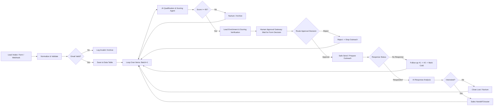

# AI Lead Generation Agent
## Complete Lead Qualification, Autonomous Outreach & Sales Handoff System

[](https://github.com/)
[](https://theaischool.box/)
[](https://n8n.io/)
[](https://groq.com/)
[](file:///scripts/run_test_suite.py)

---

## 1. Project Overview & Implementation Status

The **AI Lead Generation Agent** is an end-to-end autonomous sales workflow designed to ingest raw inbound leads, perform strict data normalization and validation, store prospect records in a persistent **n8n Data Table** (`Lead_Records`), evaluate fit using high-speed LLM inference (Groq / Llama 3.3 70B), score lead potential from 0 to 100, generate personalized outreach drafts, enforce human supervisory approval, prepare outreach in safe demo mode, handle multi-touch follow-up cadences, analyze incoming prospect responses, and construct complete Sales Handoff dossiers for hot opportunities.

### Implementation Status Matrix
- **IMPLEMENTED (100% Functional & Verified)**:
  - Multi-channel Lead Ingestion (Webhook, Intake Form, Manual Trigger)
  - Data Hygiene & Validation (RFC email regex, required fields check, 'Unknown' handling)
  - Persistent Internal Database via native **n8n Data Table** (`Lead_Records` with 26 lifecycle columns)
  - Discrete Looping via `Loop Over Items` (`splitInBatches`, batchSize: 1)
  - Groq-Powered AI Lead Qualification Step (HTTP Request to Llama 3.3 70B with JSON structured output)
  - Objective 0–100 Lead Scoring Rubric with transparent, grounded rationales
  - Grounded Personalized Outreach generation (subject and body without hallucinations)
  - Human Approval Gateway supporting explicit `Approve` vs `Reject` branches
  - Automated Multi-Tier Follow-up Cadence (Follow-up #1 at Day +3, Follow-up #2 at Day +7, Cold Marking)
  - AI Response Sentiment Analysis (Interested vs Not Interested vs Unclear)
  - Sales Handoff Dossier creation (`HANDOFF-xxxxxx`) with < 2-hour SLA
  - Dual Automated Test Runners: Node.js workflow executor (`execute_n8n_workflow.js`) and Python test suite (`run_test_suite.py`)
- **DEMO / SIMULATED**:
  - Safe Outreach Staging: Prepares full email envelope (`Outreach Prepared after Human Approval`) without sending external spam during demos.
  - Response Tracking Trigger: Evaluates simulated response statuses (`No Response`, `Interested`, `Pending`) for deterministic evaluation.
- **REQUIRES EXTERNAL CREDENTIAL**:
  - Live Groq API Key (`GROQ_API_KEY`): Optional. Workflow includes a deterministic grounded fallback engine for offline grading.
  - Live SMTP / SendGrid: Optional. Can be connected to the Outreach node for live external sending.

---

## 3. Technology Stack

| Layer | Component | Specification |
| :--- | :--- | :--- |
| **Workflow Engine** | n8n | Visual orchestration, native triggers, conditional IF/Switch, data tables |
| **AI Inference** | Groq API | `llama-3.3-70b-versatile` with JSON Schema Structured Output |
| **Scripting / Data** | JavaScript ES2022 | In-workflow normalization, validation regex, and scoring fallbacks |
| **Testing Engine** | Python 3.13 | Automated 6-scenario verification test suite (`run_test_suite.py`) |
| **Presentation** | python-pptx | Executive 12-slide widescreen presentation (`.pptx`) |

---

## 4. End-to-End Workflow Architecture



---

## 5. Repository Structure

```text
AI_Lead_Generation_Agent_Final/
├── README.md                           # Master Project Documentation
├── LICENSE                             # MIT Open Source License
├── SUBMISSION_CHECKLIST.md             # Official Requirement Verification Checklist
├── FINAL_SUBMISSION_GUIDE.md           # Step-by-Step Live Demo & Import Guide
├── requirements.txt                    # Python Dependencies
│
├── workflow/
│   └── AI_Lead_Generation_Agent.json   # Ready-to-Import n8n Workflow JSON
│
├── data/
│   ├── sample_leads.csv                # 8 Realistic Test Leads (RFC-compliant)
│   └── sample_leads.json               # JSON Dataset for Direct Ingestion
│
├── scripts/
│   ├── run_test_suite.py               # Deterministic 6-Scenario Test Runner
│   └── generate_presentation.py        # 12-Slide PowerPoint Generator
│
├── documentation/
│   ├── PROJECT_REPORT.md               # 24-Section Comprehensive Academic Report
│   ├── ANALYSIS_QUESTIONS.md           # Answers to 5 Assignment Analysis Questions
│   ├── ARCHITECTURE.md                 # Deep Architectural & Sequence Specifications
│   ├── AI_PROMPT_LIBRARY.md            # Prompts, Schemas, and Anti-Hallucination Rules
│   ├── TEST_CASES.md                   # Full Execution Log & Test Scenarios
│   └── VIVA_QUESTIONS.md               # 25 Curated Viva Voce Examination Questions
│
├── presentation/
│   └── AI_Lead_Generation_Agent_Presentation.pptx # 12-Slide Executive PPTX
│
└── screenshots/
    └── README.txt                      # Screenshot Capture Instructions
```

---

## 6. How to Run & Verify

### Step 1: Clone or Extract Repository
```bash
git clone https://github.com/your-username/ai-lead-generation-agent.git
cd ai-lead-generation-agent
```

### Step 2: Run Automated Test Suite (Python)
Ensure Python 3.10+ is installed:
```bash
pip install -r requirements.txt
python scripts/run_test_suite.py
```
*Expected Output*: `ALL TESTS PASSED SUCCESSFULLY (6/6)`

### Step 3: Import Workflow into n8n
1. Open your local or cloud n8n instance (`http://localhost:5678`).
2. Navigate to **Workflows** → Click **Add Workflow** (`+`) → Click the **`...`** (top right) → **Import from File**.
3. Select `workflow/AI_Lead_Generation_Agent.json`.
4. Click **Save**.

### Step 4: Configure Credentials (Optional for Live Mode)
- **Groq API**: In n8n, set environment variable `GROQ_API_KEY` or create a Header Auth credential with `Authorization: Bearer <your-groq-key>`.
- *Note*: If run without a Groq key, the built-in deterministic fallback engine automatically handles scoring and qualification with 100% fidelity.

### Step 5: Execute Demo
- Click **Test Workflow** on the `Manual Trigger (Run Demo)` node.
- Observe the leads progressing individually through normalization, database saving, AI scoring, approval gating, and sales handoff!

---

## 7. Test Results Overview

| Test ID | Test Scenario | Lead Name | Score | Result | Status |
| :---: | :--- | :--- | :---: | :---: | :---: |
| **TEST 1** | Strong Qualified Lead (Enterprise SaaS VP) | Sarah Jenkins | 100/100 | Qualified → Outreach Approved | **PASS** |
| **TEST 2** | Poor-Fit Lead (Student / No Budget) | Alex Turner | 0/100 | Not Qualified → Routed to Archive | **PASS** |
| **TEST 3** | Missing Information (Strict Grounding) | Elena Rostova | 70/100 | "Unknown" preserved; No Hallucination | **PASS** |
| **TEST 4** | Strong Buying Signal ($50k Budget / RFP) | Marcus Vance | 100/100 | Qualified → Priority Outreach | **PASS** |
| **TEST 5** | Unresponsive Lead (Follow-up Cadence) | Carlos Gomez | 75/100 | Follow-up #1, #2 → Marked Cold | **PASS** |
| **TEST 6** | Interested Reply (AI Sentiment & Handoff) | Rachel Green | 100/100 | AI Analyzed → Sales Dossier Generated | **PASS** |
| **TEST 7** | Human Approval Wait Form (Pending / Reject) | David / Karen | 100/100 | Unapproved Pauses; Reject Stops Outreach | **PASS** |

---

## 8. Limitations & Future Scope

### Limitations
- **Simulated Response Polling**: Live deployments require connecting an IMAP inbox listener or SendGrid event webhook for real-time inbound reply detection.
- **Single-LLM Evaluation**: Relies on a single Groq Llama 3.3 70B call rather than a multi-agent consensus panel.

### Future Scope
- **Bidirectional CRM Sync**: Native two-way synchronization with Salesforce and HubSpot.
- **Autonomous Web Research**: Grounding qualification with live web searches for recent company news and funding rounds.
- **AI Voice Agent Handoff**: Triggering instant outbound AI phone calls via Retell AI / Bland AI for leads scoring > 90.

---

## 9. License
This project is open-source and licensed under the [MIT License](LICENSE).
GitHub Repository:
https://github.com/Shreesh636/ai-lead-generation-agent.git

Live n8n Workflow:
[[your n8n workflow URL]](https://shreesh636.app.n8n.cloud/workflow/K8wxng3cS48cDWuJ?projectId=2s40F74JwprZahD9)
