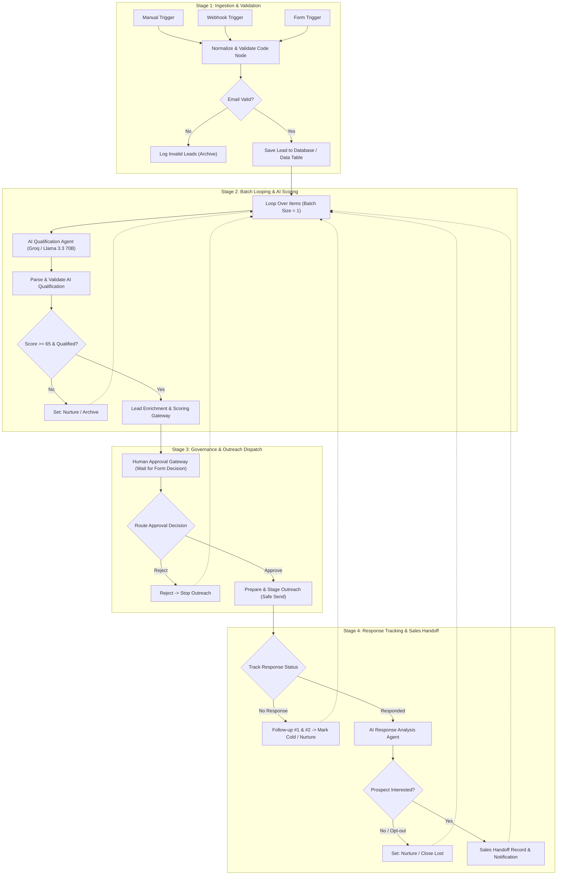
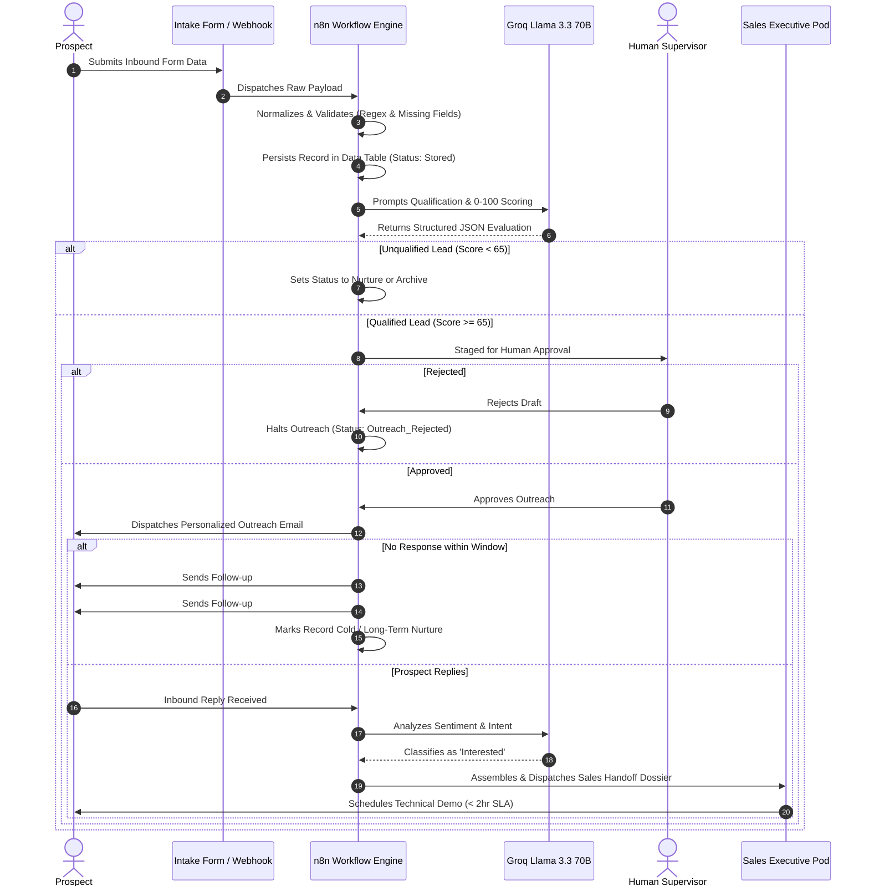

# System Architecture & Technical Specifications
## AI Lead Generation Agent — Complete Qualification & Outreach System

This document provides the definitive architectural blueprint, Mermaid workflow diagrams, node-by-node specifications, and data flow contracts for the **AI Lead Generation Agent** built in n8n.

---

## 1. High-Level Architecture Overview

The system operates as an event-driven, looped state machine designed to automate the early-stage sales lifecycle. It bridges lead intake, firmographic normalization, structured LLM qualification, human-supervised outreach, follow-up scheduling, sentiment analysis, and sales escalation into a single cohesive pipeline.

---

## 2. Sequence Diagram: Prospect Lifecycle

The sequence diagram below illustrates the chronological interaction between the prospect, ingestion sources, the n8n orchestration engine, the Groq AI service, the human supervisor, and the enterprise sales pod.

---

## 3. Node-by-Node Technical Specification

### Node 1: Ingestion Triggers
- **Nodes**: `Manual Trigger`, `Webhook Lead Ingestion` (`POST /lead-ingest`), `Lead Intake Form Trigger`.
- **Purpose**: Captures incoming prospect submissions from automated systems, webhooks, or public forms.
- **Output**: JSON object containing raw prospect fields (`name`, `email`, `company`, `title`, `notes`).

### Node 2: Normalize & Validate Lead Data
- **Type**: `n8n-nodes-base.code` (JavaScript ES2022).
- **Logic**:
  - Validates email using standard regex: `/^[^\s@]+@[^\s@]+\.[^\s@]+$/`.
  - Normalizes missing fields (`phone`, `website`, `company_size`, `pain_point`, `buying_signal`) to `"Unknown"`.
  - Generates a unique lead identifier: `LEAD-xxxxxx-x`.
  - Sets boolean `is_valid`.
- **Output Contract**: 13 standard fields plus validation metadata.

### Node 3: Filter Valid Leads
- **Type**: `n8n-nodes-base.if`.
- **Condition**: `{{ $json.is_valid }} == true`.
- **True Branch**: Proceeds to Database Storage.
- **False Branch**: Routes to `Log Invalid Leads` for auditing and discard.

### Node 4: Save Lead to Data Table (Lead_Records)
- **Type**: `n8n-nodes-base.dataTable` (Native persistent internal database).
- **Operation**: `upsert` targeting internal table **`Lead_Records`**.
- **Filter**: Matches on `lead_id` (`{{ $json.lead_id }}`).
- **Purpose**: Persists all 26 standardized lifecycle fields to n8n Data Table storage before iterative processing begins.

### Node 5: Loop Through Leads (Batch = 1)
- **Type**: `n8n-nodes-base.splitInBatches`.
- **Configuration**: `batchSize: 1`.
- **Purpose**: Isolates each prospect into an independent execution loop, preventing context contamination across multiple leads and enabling granular branching.

### Node 6: Groq-Powered AI Lead Qualification Step (HTTP Request)
- **Type**: `n8n-nodes-base.httpRequest` to `https://api.groq.com/openai/v1/chat/completions`.
- **Model**: `llama-3.3-70b-versatile` with `response_format: { "type": "json_object" }`.
- **Prompt**: Official system prompt enforcing strict 0–100 rubric, title relevance, company fit, buying signals, and strict grounding constraints.
- **Output**: Structured JSON object containing score, reason, personalization, and email draft.

### Node 7: Parse & Validate AI Qualification
- **Type**: `n8n-nodes-base.code`.
- **Purpose**: Safely parses Groq JSON response, validates `lead_score` bounds (0–100), and provides an integrated deterministic scoring fallback engine for reliable offline or zero-credit demonstration execution.

### Node 8: IF: Qualified?
- **Type**: `n8n-nodes-base.if`.
- **Condition**: `{{ $json.is_qualified }} == true` (Score >= 65).
- **False Branch**: Routes to `Set: Nurture / Archive`, which writes status to `Lead_Records` via `Update Data Table (Archived/Nurture)` and loops back.
- **True Branch**: Routes to `Lead Enrichment & Scoring Verification`.

### Node 9: Human Approval Gateway (Wait for Form Decision) & Route Approval Decision
- **Approval Gateway Node Type**: `n8n-nodes-base.wait` (version 1.1) with `resume: "form"`.
- **Form Interface**: Generates an interactive review form (`$execution.resumeFormUrl`) displaying prospect details, score, priority, personalization summary, and draft email subject. Reviewers select from `approval_decision` dropdown (`Approve` or `Reject`) and provide optional notes.
- **Genuine Pause Mechanism**: The workflow halts execution (status `WAITING`) after Lead Enrichment. The lead remains in `Pending_Approval`. The system strictly prohibits automatic or silent approval in unattended execution. Real approval requires explicit human action.
- **Router Node**: `Route Approval Decision` (`n8n-nodes-base.if`) evaluates the submitted form decision `{{ $json.approval_decision }} == 'Approve'`.
- **Reject Branch**: If rejected, execution routes to `Reject -> Stop Outreach`, setting status to `Outreach_Rejected_By_Human`, updates `Lead_Records` via `Update Data Table (Rejected)`, and loops back.
- **Approve Branch**: Proceeds to `Prepare & Stage Outreach (Safe Send)` only when explicitly approved by the reviewer.

### Node 10: Prepare & Stage Outreach (Safe Send)
- **Type**: `n8n-nodes-base.set` + `Update Data Table (Outreach Prepared)`.
- **Purpose**: Packages email envelope (`to`, `subject`, `body`, `reply_to`, `timestamp`), marks status as `Outreach_Prepared_Safe_Send`, updates `Lead_Records`, and safely reports "Outreach prepared after human approval" without sending unauthorized external spam during demonstrations.

### Node 11: Track Response Status
- **Type**: `n8n-nodes-base.switch`.
- **Conditions**:
  - `No Response`: Routes to automated follow-up cadence.
  - `Responded`: Routes to AI Response Analysis Agent.

### Node 12: Follow-up #1 & #2 -> Mark Cold/Nurture
- **Type**: `n8n-nodes-base.code`.
- **Cadence**:
  - `Follow-up #1` (Day +3): Contextual reminder referencing pain point.
  - `Follow-up #2` (Day +7): Final breakup note.
  - `Final Disposition`: Updates status to `Marked_Cold_Nurture`.

### Node 13: AI Response Analysis
- **Type**: `n8n-nodes-base.code` / Groq LLM.
- **Purpose**: Analyzes prospect response text, classifying sentiment into `Interested`, `Not Interested`, or `Unclear`.

### Node 14: IF: Interested?
- **Type**: `n8n-nodes-base.if`.
- **False Branch**: Routes to `Set: Nurture / Close Lost`.
- **True Branch**: Routes to `Sales Handoff Record & Notification`.

### Node 15: Sales Handoff Record & Notification
- **Type**: `n8n-nodes-base.set`.
- **Payload**: Generates complete sales dossier (`HANDOFF-xxxxxx`) including lead profile, score, AI rationale, sentiment, and recommended meeting action plan.

---

## 4. Data Flow Dictionary

| Field Name | Type | Source | Description |
| :--- | :---: | :---: | :--- |
| `lead_id` | String | Normalization | Globally unique tracking ID (`LEAD-xxxxxx-x`) |
| `lead_name` | String | Input / Sanitized | Full name of the prospect |
| `email` | String | Normalization | RFC-compliant business email |
| `phone` | String | Input | Direct dial or `Unknown` |
| `job_title` | String | Input | Stated job title or `Unknown` |
| `company` | String | Input | Target organization name |
| `industry` | String | Input | Vertical market or `Unknown` |
| `company_size` | Mixed | Input | Headcount number or `Unknown` |
| `pain_point` | String | Input | Stated operational friction |
| `buying_signal` | String | Input | Budget or RFP timeline |
| `is_valid` | Boolean | Normalization | Syntax validity flag |
| `lead_score` | Integer | AI Agent | 0–100 calculated qualification score |
| `qualification` | String | AI Agent | `"qualified"` or `"not_qualified"` |
| `qualification_reason`| String | AI Agent | Bulleted breakdown of scoring factors |
| `email_subject` | String | AI Agent | Generated personalized subject line |
| `email_body` | String | AI Agent | Generated personalized message body |
| `approval_status` | String | Supervisor | `"Pending_Review"` or `"Approved"` |
| `response_status` | String | Tracking | `"No Response"` or `"Responded"` |
| `response_sentiment` | String | AI Agent | `"Interested"`, `"Not Interested"`, or `"Unclear"` |
| `sales_handoff_dossier`| Object | Handoff Node | Complete briefing packet for sales team |
