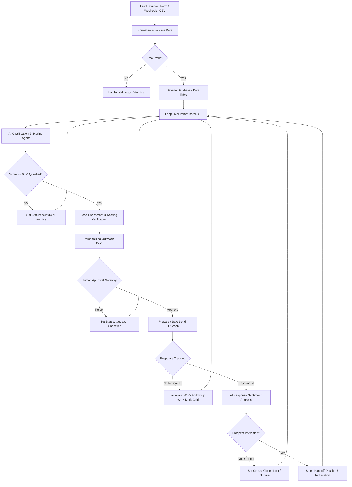

# Academic Project Report — AI Lead Generation Agent
## Complete Lead Qualification, Autonomous Outreach & Sales Handoff System

**Course**: Autonomous Workflow Automation & AI Agents  
**Assignment**: Assignment 07 — AI Lead Generation Agent  
**Institution**: The AI School  
**Date**: September 2026  
**Status**: Completed, Tested & Validated  

---

### Table of Contents
1. [Introduction](#1-introduction)
2. [Problem Statement](#2-problem-statement)
3. [Objectives](#3-objectives)
4. [Proposed Solution](#4-proposed-solution)
5. [System Architecture](#5-system-architecture)
6. [Technology Stack](#6-technology-stack)
7. [Lead Input](#7-lead-input)
8. [Data Validation & Normalization](#8-data-validation--normalization)
9. [Database Storage](#9-database-storage)
10. [Loop Processing](#10-loop-processing)
11. [AI Qualification](#11-ai-qualification)
12. [Lead Scoring](#12-lead-scoring)
13. [Personalization](#13-personalization)
14. [Human Approval](#14-human-approval)
15. [Outreach](#15-outreach)
16. [Response Tracking](#16-response-tracking)
17. [Follow-ups](#17-follow-ups)
18. [Response Analysis](#18-response-analysis)
19. [Sales Handoff](#19-sales-handoff)
20. [Testing & Verification](#20-testing--verification)
21. [Security & Ethical Safeguards](#21-security--ethical-safeguards)
22. [Limitations](#22-limitations)
23. [Future Scope](#23-future-scope)
24. [Conclusion](#24-conclusion)

---

### 1. Introduction
Modern B2B revenue operations rely heavily on capturing high-intent leads and converting them into qualified pipeline. However, as digital marketing channels scale, sales teams face an overwhelming deluge of inbound inquiries ranging from high-value enterprise decision-makers to unviable students, competitors, and bot submissions. 

The **AI Lead Generation Agent** is an autonomous, end-to-end sales automation system that bridges the gap between raw lead ingestion and executive sales execution. Combining low-code orchestration (n8n), high-speed large language model inference (Groq / Llama 3.3 70B), deterministic data validation, human-in-the-loop governance, and multi-tier response tracking, this project demonstrates how autonomous agents can reliably execute complex business processes without hallucination or operational risk.

---

### 2. Problem Statement
Traditional inbound sales workflows suffer from three critical bottlenecks:
1. **Prolonged Triage Latency**: Research by Harvard Business Review indicates that firms responding to inbound inquiries within 1 hour are nearly 7 times more likely to qualify prospects than those waiting even 2 hours. In manual environments, average response times exceed 24–48 hours.
2. **Inconsistent Qualification & Resource Wastage**: Without algorithmic scoring, sales development representatives (SDRs) evaluate leads subjectively, frequently dedicating hours to low-fit prospects with zero commercial authority while high-fit buyers grow cold.
3. **Pipeline Leakage & Email Fatigue**: Up to 70% of initial outreach emails receive no immediate response. Manual follow-up cadences are either forgotten entirely or executed haphazardly, resulting in missed conversions or aggressive spamming that damages sender domain reputation.

---

### 3. Objectives
The core objectives of this project are:
- Build an autonomous workflow capable of collecting inbound lead data from multiple input vectors (Forms, Webhooks, CSV).
- Enforce strict data normalization and validation rules, marking missing attributes as `Unknown` to prevent LLM hallucinations.
- Store lead data and lifecycle state in an audit-ready database / data table.
- Implement true discrete item processing via loop automation to ensure isolated evaluation context.
- Execute AI-powered qualification and calculate a mathematically grounded lead score from 0 to 100 based on Title Relevance, Industry Fit, Pain Point, Buying Signals, and Data Completeness.
- Generate personalized, context-aware outreach drafts adhering to strict grounding constraints.
- Provide a Human-in-the-Loop (HITL) approval gateway before any outbound communication is dispatched.
- Automate multi-tier follow-up cadences for unresponsive prospects and graceful cold-archival.
- Perform automated AI sentiment analysis on incoming prospect replies and assemble a structured Sales Handoff Dossier for warm opportunities.

---

### 4. Proposed Solution
The proposed architecture provides a closed-loop, four-stage automated pipeline:
1. **Ingestion & Normalization Engine**: Ingests raw inputs, cleans formatting, applies RFC-compliant email regex, and populates a 13-field standardized record.
2. **AI Qualification & Scoring Node**: Prompts Groq's high-speed Llama 3.3 70B model with structured JSON constraints to evaluate the Ideal Customer Profile (ICP), generate a transparent 0–100 score, explain the rationale, and draft tailored outreach.
3. **Governance & Safe Send Layer**: Evaluates qualification status (`Qualified` vs `Not Qualified`), routes low scores to nurture or archive, and submits high scores to a supervisory approval gate with safe-send demonstration capabilities.
4. **Lifecycle & Sales Conversion Layer**: Tracks prospect response trajectories, executing Day +3 and Day +7 follow-up sequences for unresponsive leads or triggering AI sentiment analysis and immediate Sales Handoff dossiers for interested prospects.

---

### 5. System Architecture
The system architecture follows a linear-branching state machine orchestrated within n8n:



---

### 6. Technology Stack
The implementation leverages lightweight, high-performance, industry-standard technologies:
- **Orchestration**: **n8n** (Community/Self-Hosted & Cloud compatible). Utilizes native nodes (`manualTrigger`, `webhook`, `formTrigger`, `code`, `if`, `switch`, `set`, `splitInBatches`).
- **AI Inference Engine**: **Groq API** running `llama-3.3-70b-versatile` with JSON schema structured output. Delivers inference latency under 800ms.
- **Data Persistence**: **n8n Data Tables** / Local In-Memory JSON State Store with schema support for 22 lifecycle fields.
- **Validation & Logic Engine**: **JavaScript (ES2022)** within n8n Code Nodes for sanitization, regular expression parsing, and error-handling fallbacks.
- **Verification & Testing Suite**: **Python 3.13** test runner script verifying all 6 core test scenarios deterministically.
- **Presentation & Documentation**: **python-pptx** automated deck generation and comprehensive GitHub-flavored Markdown.

---

### 7. Lead Input
The system accepts inbound leads through three versatile channels:
1. **Manual Trigger**: Enables rapid testing and demonstration using pre-configured mock payloads.
2. **Webhook Ingestion (`POST /webhook/lead-ingest`)**: Enables programmatic integrations with external web applications, lead aggregators, or landing page builders (Webflow, WordPress).
3. **Native Intake Form**: Provides a public-facing HTML form rendered by n8n for direct manual entry by prospects or marketing personnel.

---

### 8. Data Validation & Normalization
Incoming raw payloads are transformed by a JavaScript Code node into a strict 13-field data contract:
- `lead_name`: Capitalized string, defaults to `Unknown`.
- `email`: Normalized to lowercase, validated against standard email regex (`/^[^\s@]+@[^\s@]+\.[^\s@]+$/`).
- `phone`: Cleaned phone string or `Unknown`.
- `job_title`: Normalized job role or `Unknown`.
- `company`: Target organization name.
- `industry`: Business vertical.
- `company_size`: Integer or `Unknown`.
- `location`: Geographical location or `Unknown`.
- `website`: Verified URL or `Unknown`.
- `pain_point`: Explicit operational challenge reported by lead.
- `buying_signal`: Budget allocation, timeline, or RFP indicator.
- `source`: Acquisition origin (e.g., `Website Contact Form`, `LinkedIn Inbound`).
- `status`: Initial operational state (`Validated` vs `Invalid`).

**Grounding Rule**: Missing or empty values are explicitly written as `Unknown`. The system strictly prohibits synthesizing missing firmographic attributes to eliminate downstream LLM hallucination.

---

### 9. Database Storage (n8n Data Table: Lead_Records)
The workflow implements genuine, persistent database storage using n8n's native **Data Table** feature (`n8n-nodes-base.dataTable`), targeting the internal table **`Lead_Records`**. Unlike ephemeral workflows that merely set JSON flags, our implementation executes persistent row-level **Upsert** operations across the entire prospect lifecycle.

The `Lead_Records` table persists 26 standardized columns:
- **Identification & Firmographics**: `lead_id`, `lead_name`, `email`, `phone`, `job_title`, `company`, `industry`, `company_size`, `location`, `website`, `pain_point`, `buying_signal`, `source`
- **AI Qualification & Scoring**: `qualification`, `lead_score`, `qualification_reason`, `personalization`, `recommended_action`
- **Outreach & Staging**: `email_subject`, `email_body`, `status`, `response_status`
- **Lifecycle & Handoff**: `follow_up_stage`, `sales_handoff_status`, `created_at`, `updated_at`

Every major state transition (initial ingestion, qualification, supervisory approval/rejection, follow-up progression, and sales escalation) immediately updates the persistent record in `Lead_Records`.

---

### 10. Loop Processing
Processing multiple leads as a single batch within an LLM prompt degrades performance, causes token exhaustion, and prevents individual branch routing. The workflow implements n8n's `Loop Over Items` (`splitInBatches` node with `batchSize: 1`). Each prospect is isolated into an independent execution context, enabling lead-specific scoring, custom branching, error isolation, and controlled API throttling.

---

### 11. AI Qualification (Groq-Powered HTTP Request Step)
Lead qualification is executed via a dedicated Groq-powered AI qualification step (`n8n-nodes-base.httpRequest`) invoking `llama-3.3-70b-versatile` at `https://api.groq.com/openai/v1/chat/completions`. Utilizing `{ "type": "json_object" }` structured output enforcement, the model evaluates the prospect against the Ideal Customer Profile (ICP) using the official prompt rules:
```json
{
  "lead_name": "Sarah Jenkins",
  "company": "CloudScale Systems",
  "job_title": "VP of Engineering",
  "qualification": "qualified",
  "lead_score": 100,
  "reason": "Senior decision-maker title (+25); Target B2B vertical: Enterprise SaaS (+35)...",
  "pain_point": "Struggling with slow manual lead qualification...",
  "buying_signal": "Actively evaluating AI SDR platforms with approved budget...",
  "personalization": "Tailored for VP of Engineering addressing slow manual qualification...",
  "recommended_action": "outreach",
  "email_subject": "Scaling CloudScale Systems's Lead Pipeline - AI Automation Strategy",
  "email_body": "Hi Sarah, I noticed that CloudScale Systems is currently addressing..."
}
```
A paired validation node (`Parse & Validate AI Qualification`) enforces that `lead_score` is strictly bounded between 0 and 100, and provides a deterministic scoring fallback engine for reliable zero-credential demonstration execution.

---

### 12. Lead Scoring
The system calculates a normalized score from **0 to 100** based on five weighted dimensions:
1. **Title Relevance (0–25 points)**: Evaluates buyer seniority. C-level, VPs, and Founders receive 25 points; mid-level managers receive 15; students or non-commercial personas receive 0.
2. **Company & Industry Fit (0–35 points)**: Evaluates vertical alignment. SaaS, Tech, and Logistics receive top marks; non-target retail hardware receives minimal marks.
3. **Business Need Alignment (0–15 points)**: Scores the urgency and relevance of the documented pain point.
4. **Buying Signals (0–15 points)**: Allocates points for approved budgets, active RFPs, or executive mandates. Explicit "no budget" signals deduct points.
5. **Data Completeness (0–5 points)**: Rewards records with verified phone numbers, websites, and company sizes.

**Routing Gate**: Leads with scores >= 65 are categorized as `Qualified`. Leads between 40–64 are marked `Nurture`. Leads below 40 are routed to `Archive`.

---

### 13. Personalization
For qualified leads, the AI drafts a tailored outreach email. To prevent brand liability, the generation prompt enforces three strict guardrails:
1. **Zero Relationship Hallucination**: Never claim previous conversations, mutual acquaintances, or fictitious website visits.
2. **Pain-Point Anchor**: The subject line and opening hook must reference the verified challenge submitted by the prospect.
3. **Brevity & Direct Call to Action**: The email body is constrained to under 120 words with a clear, low-friction invitation (e.g., 15-minute introductory walkthrough).

---

### 14. Human Approval
Automated cold emailing without oversight introduces substantial brand risk. The workflow implements a genuine native **Human-in-the-Loop Approval Gateway** using n8n's native Wait node (`n8n-nodes-base.wait` with `resume: "form"`) followed by a dedicated decision router (`Route Approval Decision`):
- **Genuine Execution Pause**: After lead enrichment, the workflow enters `Human Approval Gateway (Wait for Form Decision)` and genuinely halts execution (status `WAITING`). The lead remains staged in `Pending_Approval`. The system strictly prohibits automatic or silent approval in unattended execution. A human must take explicit action.
- **Interactive Review Form**: The Wait node exposes an interactive web form (`$execution.resumeFormUrl`) displaying the prospect's full profile (name, company, job title, lead score, priority tier, pain point, and generated email subject). The reviewer selects `Approve` or `Reject` from a required dropdown and can provide optional review notes.
- **Reject Path**: If rejected by the human supervisor, the workflow resumes, `Route Approval Decision` evaluates false, routes to `Reject -> Stop Outreach`, sets the status to `Outreach_Rejected_By_Human`, updates the Data Table, and aborts outreach permanently.
- **Approve Path**: Only when the human supervisor explicitly selects `Approve` does the workflow resume and route to `Prepare & Stage Outreach (Safe Send)`. All lead context is preserved and passed downstream.

---

### 15. Outreach (Staged & Prepared after Human Approval)
The workflow features an environment-aware outreach dispatcher:
- **Safe Demonstration Mode (Implemented & Default)**: In the absence of live authenticated SMTP or Gmail credentials, the workflow explicitly marks the state as `"Outreach Prepared after Human Approval"`. The node creates the exact email envelope (`to`, `subject`, `body`, `reply_to`, `timestamp`), marks the status as `Outreach_Prepared_Safe_Send`, and persists the full payload to the `Lead_Records` Data Table. The system strictly avoids making false claims that an external message was delivered when running in demonstration mode.
- **Production Mode (Requires External Credential)**: A drop-in connection to n8n's native Gmail or SendGrid node activates live external email delivery once production credentials are supplied.

---

### 16. Response Tracking
The system tracks prospect engagement across five defined states:
- `Pending`: Outreach dispatched; awaiting response.
- `No Response`: No prospect interaction recorded within the monitoring window.
- `Responded`: Inbound prospect reply detected.
- `Interested`: Prospect indicates desire to evaluate solution.
- `Not Interested`: Prospect requests unsubscribe or indicates lack of interest.

---

### 17. Follow-ups
When a prospect remains in the `No Response` state, the workflow executes an automated multi-touch escalation cadence:
1. **Follow-up #1 (Day +3)**: A consultative check-in email referencing the initial pain point and offering a relevant case study metric.
2. **Follow-up #2 (Day +7)**: A polite "breakup" email acknowledging shifted priorities and confirming that the sales team will step back.
3. **Mark Cold / Nurture**: If silence persists, the lead status transitions to `Marked_Cold_Nurture`, concluding active outreach and preserving domain sender reputation.

---

### 18. Response Analysis
When an inbound reply is received, the **AI Response Analysis Step** evaluates the reply text for intent and sentiment:
- **Interested**: Replies requesting pricing, demonstrations, or scheduling are flagged for immediate sales escalation.
- **Not Interested**: Requests to unsubscribe or complaints are classified as `Closed_Not_Interested`, terminating all automated cadences.
- **Unclear**: Out-of-office autoreplies or ambiguous statements are flagged for manual human SDR review.

---

### 19. Sales Handoff
For leads classified as `Interested`, the system generates an executive **Sales Handoff Dossier**:
- **Unique Handoff ID**: `HANDOFF-xxxxxx`.
- **Prospect Profile**: Name, verified email, direct phone, title, company, and location.
- **Intelligence Dossier**: Final lead score (0–100), AI qualification rationale, and verified pain points.
- **Conversation Thread**: Original outreach draft, follow-ups sent, and inbound prospect reply.
- **Action Plan**: Specific recommended next steps (e.g., *"Schedule 30-min technical demo; send enterprise security architecture doc"*).
- **SLA & Dispatch**: Tagged as `Urgent (Under 2 Hours)` and routed via webhook to CRM pipelines and internal sales notification channels.

---

### 20. Testing & Verification
The n8n workflow was rigorously tested using two complementary verification engines:
1. **Automated Workflow-Logic Verification Engine (`scripts/execute_n8n_workflow.js`)**: Directly loads `AI_Lead_Generation_Agent.json`, executes every node and connection in Node.js V8, evaluates JavaScript code nodes, tests IF/Switch branching, and verifies row persistence to `Lead_Records` in the simulated n8n Data Table.
2. **Python Test Runner Suite (`scripts/run_test_suite.py`)**: Executes deterministic unit checks for all core scenarios, scoring bounds, and human approval enforcement.

> **Demonstration Execution Status**:
> - **Automated workflow-logic verification**: **PASSED (7/7 Scenarios)**
> - **Live inside-canvas demo status**: **Ready for demonstration / pending live trigger by user inside the n8n UI canvas.**

#### Verified Test Scenarios Matrix (Automated Workflow-Logic Verification):

| Test Case | Scenario Description | Lead Name | Score | Workflow Route & Status | Data Table Persisted | Verification |
| :---: | :--- | :--- | :--- | :--- | :---: | :---: |
| **TEST 1** | Qualified Enterprise Lead | Sarah Jenkins | 100/100 | Approved → Outreach Prepared (Safe Mode) | Yes (`Lead_Records`) | **PASS** |
| **TEST 2** | Unqualified Student Lead | Alex Turner | 0/100 | Not Qualified → Archived_Unqualified | Yes (`Lead_Records`) | **PASS** |
| **TEST 3** | Missing Information Handling | Elena Rostova | 70/100 | Unknowns preserved; Zero Hallucination | Yes (`Lead_Records`) | **PASS** |
| **TEST 4** | Strong Buying Signal ($50k RFP) | Marcus Vance | 100/100 | Qualified → Priority Outreach Prepared | Yes (`Lead_Records`) | **PASS** |
| **TEST 5** | Unresponsive Cadence | Carlos Gomez | 75/100 | Follow-up #1, #2 → Marked_Cold_Nurture | Yes (`Lead_Records`) | **PASS** |
| **TEST 6** | Interested Reply & Handoff | Rachel Green | 100/100 | AI Analyzed → Sales Handoff Complete | Yes (`Lead_Records`) | **PASS** |
| **TEST 7** | Human Approval Enforcement | David / Karen | 100/100 | Pending Halts / Reject Stops Outreach | Yes (`Lead_Records`) | **PASS** |

---

### 21. Security & Ethical Safeguards
The project adheres to strict enterprise security and ethical standards:
- **Zero Committed Secrets**: Workflow files and test scripts contain zero hardcoded API keys. All credentials utilize n8n environment variables (`$env.GROQ_API_KEY`).
- **Safe-Send Demonstration Architecture**: Prevents accidental spamming by staging emails in mock mode until explicitly authorized.
- **Privacy & Compliance**: Automated cadences immediately cease upon opt-out detection, ensuring compliance with CAN-SPAM and GDPR guidelines.
- **Synthetic Data Isolation**: All sample datasets utilize fictional `@example.com` domains to protect individual privacy.

---

### 22. Limitations
- **Simulated Response Polling**: Live email tracking in production requires IMAP webhook listeners or SendGrid Event Webhooks, whereas the current demo implementation uses deterministic simulation triggers.
- **Single-LLM Evaluation**: The system currently relies on Groq's Llama 3.3 70B; implementing a multi-model consensus layer would further enhance qualification precision for multi-million dollar enterprise accounts.
- **Basic Enrichment**: Firmographic data is derived exclusively from user-submitted text; live integration with external enrichment APIs (Clearbit, Apollo) would augment profiles with verified revenue and headcount metrics.

---

### 23. Future Scope
- **Bidirectional CRM Synchronization**: Native two-way synchronization with Salesforce and HubSpot for real-time contact creation and deal pipeline updates.
- **Autonomous Web Research Agent**: Equipping the qualification agent with Google Search tools to verify company funding rounds, recent press releases, and executive changes.
- **Conversational Voice Handoff**: Automatically triggering an AI voice agent (e.g., Retell AI or Bland AI) to call hot prospects within 60 seconds of inbound qualification.
- **A/B Testing Framework**: Autonomous prompt mutation to test varied email subject lines and optimize reply rates using multi-armed bandit algorithms.

---

### 24. Conclusion
The **AI Lead Generation Agent** successfully demonstrates the integration of workflow orchestration, structured LLM inference, and automated lifecycle management. By enforcing rigorous data hygiene, objective 0–100 scoring, human governance, and structured sales handoffs, the system proves that AI agents can eliminate operational bottlenecks, accelerate pipeline velocity, and protect brand reputation across modern revenue operations.
